# 원총 사업/정책이슈 홍보 플로우

## 변경 히스토리  

| 날짜 | 개요 | 작성자 | 
|-----|-----|------|
| 2021-06-27 | 초안 작성 | 제49대 대학원 총학생회 edge 부회장 김수지 |
| 2021-07-11 | 영문 번역 및 자치단체 홍보 프로세스 추가 | 제49대 대학원 총학생회 edge 부회장 김수지 |
| 2021-07-11 | 영문 번역 시 번역 관련 안내 문구 추가, 자치단체 메일 발송 주체 설정 | 제49대 대학원 총학생회 edge 부회장 김수지 |

## 1. 레벨 포맷
~~~
매체-(수신인)-(번역)
~~~

### 1-1. 매체 구분
|              |:red_circle: 레드 | :green_circle: 그린 | :large_blue_circle: 블루 |
|:------------:|:----:|:----:|:----:|
| GSA 홈페이지 |   :ballot_box_with_check:  |   :ballot_box_with_check:  |   -  |
|   단체메일   |   :ballot_box_with_check:  |   -  |   -  |
|  인스타그램  |   :ballot_box_with_check:  |   :ballot_box_with_check:  |   -  |
|  KAIST 포탈  |   :ballot_box_with_check:  |   -  |   -  |
|     아라     |   :ballot_box_with_check:  |   -  |   :ballot_box_with_check:  |

### 1-2. 홍보 대상 구분
|   홍보 대상   |  줄임말  |                      설명                      |
|:-------------:|:--------:|:----------------------------------------------|
|  전체 구성원  |   **전원**   | 본원 대학원생, 학부생, 서울캠 대학원생, 교직원 |
|   전체 학생   | **전체학생** | 본원 대학원생, 학부생, 서울캠 대학원생         |
| 전체 대학원생 | **전체원생** | 본원 대학원생, 서울캠 대학원생                 |
|   대전 학생   | **대전학생** | 본원 대학원생, 학부생                          |
| 대전 대학원생 | **대전원생** | 본원 대학원생                                  |
|  특정 수신인  |   **특정**   | 특정 수신인 그룹                               |

### 1-3. 국영문 번역 구분
| 번역 구분 	| 설명 	|
|:-:	|:-	|
| **국문** 	| 홍보 대상 구분 중 한국인에 해당하는 그룹에만 발송 	|
| **국영** 	| 홍보 대상 구분 중 한국인 및 외국인에 해당하는 그룹에 발송 반드시 영문 번역이 되어야 함. (1) 한국인과 외국인 대상 메일을 구분해 발송 또는 (2) 한국인과 외국인 대상으로 통합된 메일을 발송하는 경우 국영문을 모두 포함해 발송 	|

## 2. 홍보 플로우
- 홍보 콘텐츠에 대한 기획 및 책임은 실무 담당자가 가짐. 
- 홍보 담당자는 실행만 하면 될 수준의 구체적인 내용을 반드시 전달.

## 3. 홍보 신청 방법
### 3-1. 영문 번역
- **사업 담당자가** 영문으로 번역 진행 (온라인 서비스를 활용한 기계 번역)
    - 영문 홍보글 상단에 번역에 관련한 **안내 문구 반드시** 추가
    > This email (post) has been translated by the automated system. If you have any suggestions or comments on our translation, please let us know via the following link: https://forms.gle/Yi6XrLD3dZ4dvedr5

- 번역 담당자는 번역된 영문의 **검토만** 진행 (온라인 서비스를 활용한 인간 번역)
- 참고 서비스:
    - 네이버 파파고: https://papago.naver.com/
    - Grammarly: https://www.grammarly.com/
    - Quillbot: https://quillbot.com/
    - Ludwig: https://ludwig.guru/
    - thesaurus: https://www.thesaurus.com/

### 3-2. 홍보 신청 마감일
- 영문 검토 요청 시 **이틀 전에** 신청 (번역 검토 1일 + 홍보 검토 1일)
- 영문 검토 미요청 시 **하루 전에** 신청 (당일 신청 시 포청천 발동)

### 3-3. 홍보 신청 프로세스
- 슬랙 #49th_홍보부 채널에 홍보 레벨과 함께 **담당자 태그** 필수
- 해당 레벨에서 **특정 매체를 제외**하거나, **특정 수신인을 제외**할 경우 **타당한 사유**를 반드시 작성해야함.
- 예시:
    - **슬기로운 대학원 생활 강연 홍보 (:red_circle: 레드-전체원생-국문)**
        - 홍보 일자: 2021/06/14(월)
        - 영문 누락 사유: 한국어로 강연 진행
        - 매체:
            - GSA 홈페이지 @담당자
            - 단체메일 @담당자
            - 인스타그램 @담당자
            - KAIST 포탈: 학생지원팀과 중복 홍보로 생략합니다.
            - 아라 @담당자

### 3-4. 홍보 게시 담당자 가이드라인
- 홍보 완료 여부의 체크를 위해 본인이 담당한 홍보물 게시 완료 후 완료 여부를 기록
- 기록 위치: 구글 드라이브 > 6. 정책 위원회 > 2. 열려라 원총! 위원회 > 0. 사업/정책이슈 홍보 플로우 > 2021 상반기 홍보물 게시 리스트 [(링크)](https://docs.google.com/spreadsheets/d/1McPchuD2nXZTboLEu62EmiKcyg9GFY0tWfKxqfJPvuc/edit#gid=0)
